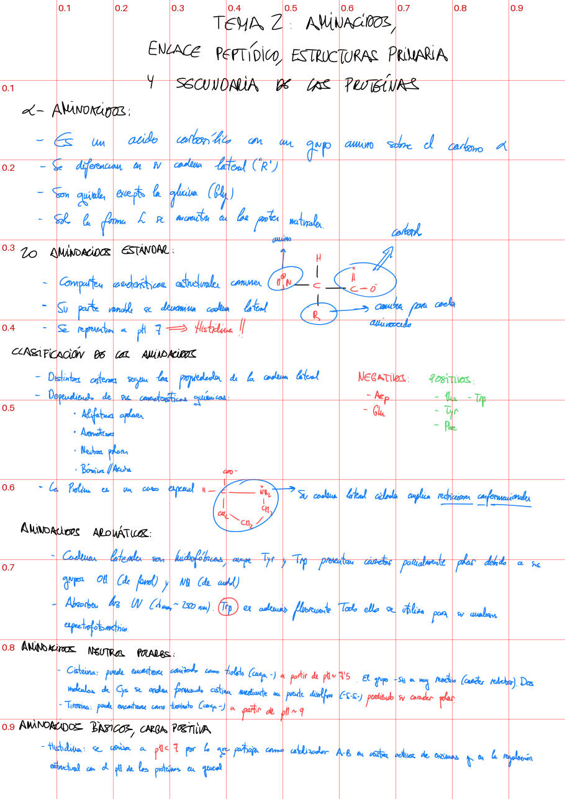

# Apuntes.md

Una skill para agentes de IA (probada con Claude Code) que convierte **apuntes escritos a mano y escaneados** en notas Markdown listas para un vault de **Obsidian**: texto limpio, fórmulas en LaTeX, estructuras químicas, diagramas redibujados y, lo más importante, **sin inventar nada**.

```
Escaneo (PDF/imagen) → agente + skill → nota.md + assets/ → Obsidian
```

No hay API ni app propia: quien lee la hoja es el agente dentro de la sesión. Los scripts solo hacen lo que el agente no puede hacer a ojo: dibujar moléculas, compilar diagramas y recortar el escaneo.


**Estado: v1.0.0.** Probada con apuntes reales de Bioquímica: una hoja con texto, fórmulas, estructuras y una gráfica se retoca en **menos de 5 minutos**, y la estereoquímica que no está en la hoja no se inventa. Ver [CHANGELOG](CHANGELOG.md).

## Qué hace

| En el apunte | En la nota |
|---|---|
| Texto a mano | Markdown con encabezados. La letra difícil se lee **con el contexto**, sin corregir ni reescribir nada |
| Fórmulas | LaTeX (`$...$`, `$$...$$`) |
| Estructuras químicas | SMILES validado con RDKit → SVG. Los grupos R se dibujan como R/R′ y los carbonos quirales sin configuración llevan `*` |
| Diagramas, gráficas, cargas parciales, micelas… | Redibujados en **TikZ/chemfig** → SVG, con todas las etiquetas del original |
| Lo ambiguo | Recorte del original dentro de un aviso `[!warning]`, para que el arreglo sea inmediato |
| Lo dudoso | `==palabra (?)==` o `[!warning]`. **Nunca inventado** |

**Una nota por tema** (`Bioquímica - Tema 1.md`), con índice navegable y una **estética didáctica** (definiciones, puntos importantes, fórmulas destacadas, tablas…) que **no cambia ni una palabra**: se comprueba con un script. Todas las reglas están en [`SKILL.md`](skills/apuntes-a-md/SKILL.md).

### Cómo trabaja

1. **Localiza** cada elemento sobre una cuadrícula y lee la letra por franjas ampliadas.
   
2. **Escribe** la nota elemento a elemento, en el orden del original.
3. **Verifica** cada molécula y figura contra el recorte del original, mirando el SVG final y no un intermedio.
4. **Resume** lo que ha marcado como dudoso y sus decisiones de estereoquímica.

## Requisitos (Windows)

- **Python ≥ 3.12** y **[uv](https://docs.astral.sh/uv/)**: los scripts declaran sus dependencias inline (PEP 723) y se ejecutan con `uv run`, sin venv que crear.
- **MiKTeX** con "Install missing packages on-the-fly: Always" (trae `pdflatex`, `dvisvgm`, `pdftocairo` y `pdffonts`).
- **Git Bash** para `tikz2svg.sh`.
- **Edge o Chrome** (opcional, recomendado) para el preview del SVG final.

## Instalación (cualquier agente)

La skill sigue el formato abierto **[Agent Skills](https://agentskills.io)** (`SKILL.md` + `scripts/`), que entienden Claude Code, Gemini CLI, Codex, Cursor, Copilot y otros. Instalarla es enlazar la misma carpeta allí donde cada agente busca sus skills:

```powershell
.\instalar.ps1 -Agentes claude,gemini,codex
```

| Agente | Carpeta de skills | Alternativa propia |
|---|---|---|
| Claude Code | `~/.claude/skills/` | — |
| Gemini CLI | `~/.gemini/skills/` o `~/.agents/skills/` | `gemini skills install <ruta>/skills/apuntes-a-md --consent` |
| Codex | `~/.codex/skills/` | — |

El instalador crea *junctions*, así que los cambios del repo se ven al instante sin copiar nada. Con `-WhatIf` muestra lo que haría sin tocar nada.

El agente tiene que poder **ver imágenes/PDF**, **ejecutar comandos** y **escribir ficheros**.

Después basta con pedirle algo como *"pasa a Markdown las págs. 6–7 de este escaneo a mi vault"*.

**Si trabajas sobre el repo** con un agente, las instrucciones están en [`AGENTS.md`](AGENTS.md). `CLAUDE.md` y `GEMINI.md` solo lo importan.

> Probada a fondo con Claude Code. En Gemini CLI y Codex la instalación sigue su documentación oficial, pero todavía no se ha probado una conversión completa.

## Scripts

| Script | Qué hace |
|---|---|
| `smiles2svg.py` | Valida el SMILES, dibuja el SVG y devuelve un JSON con los estereocentros (asignados o no) |
| `tikz2svg.sh` | `.tex` → SVG (`pdflatex` + `dvisvgm`). Falla si el texto se fuera a perder; `--preview` renderiza el SVG final |
| `crop.py` | Cuadrícula de coordenadas y recortes del escaneo |
| `verificar_contenido.py` | Comprueba que la estética no ha cambiado ni una palabra: compara la transcripción fiel con la nota final |
| `ordenar_vault.py` | *Experimental:* coloca las notas en `<Asignatura>/` según su frontmatter. Se rediseña en la v3 |

## Configurar Obsidian

**No hace falta ningún plugin.** SVG, fórmulas (MathJax), callouts y resaltados se ven de serie. Los diagramas TikZ llegan ya compilados, así que no hace falta TikZJax.

1. **Fragmentos CSS:** copia los dos ficheros de [`obsidian/`](skills/apuntes-a-md/obsidian/) a `<vault>/.obsidian/snippets/` y actívalos en *Ajustes → Apariencia → Fragmentos CSS*:
   - `apuntes-estetica.css`: callouts de definición, importante, fórmula, ficha y sesión, y los colores de la paleta.
   - `svg-modo-oscuro.css`: para ver los SVG en el tema oscuro.
2. **Ajustes → Archivos y enlaces:** activa *Actualizar enlaces internos automáticamente* y pon *Formato de los nuevos enlaces* en **Ruta relativa al archivo**.

## Estructura

```
skills/apuntes-a-md/   SKILL.md, scripts/, templates/, obsidian/
galeria/proceso/       capturas de cómo trabaja la skill
pruebas/               escaneos y salidas de prueba (no se suben)
```

## Hoja de ruta

- **v1.0.0** ✅ Conversión fiel de apuntes a mano a Markdown + Obsidian.
- **v2** (en diseño) Skill independiente del agente, estética didáctica acordada (sin tocar el contenido), figuras de más calidad y los temas completos de Bioquímica como entregable.

## Licencia

[MIT](LICENSE)
