# Galería

Apuntes **reales** de Bioquímica (Temas 1–4, escritos a mano en tableta) convertidos con la skill [`apuntes-a-md`](../../skills/apuntes-a-md/). Todo lo que hay aquí ha salido del flujo de la skill y ha pasado `verificar_contenido.py`: **ni una palabra cambiada** respecto a la transcripción.

## Antes y después

**Gráficas.** La forma de la curva y las marcas de la hoja, sin inventar valores:

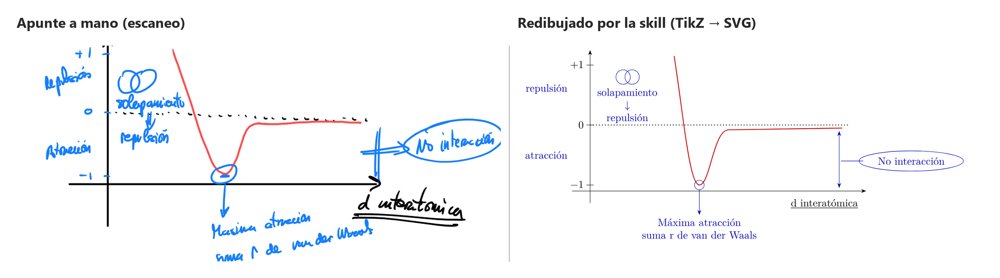

**Química.** Estructuras resonantes del enlace peptídico en chemfig, con sus flechas curvas:


**Dibujos con iconos (v2.1).** Los iconos de [Bioicons](https://bioicons.com/) sustituyen a los dibujos y conservan todo lo de la hoja: los residuos, la hélice rodeada en la terciaria y la cadena marcada en la cuaternaria.

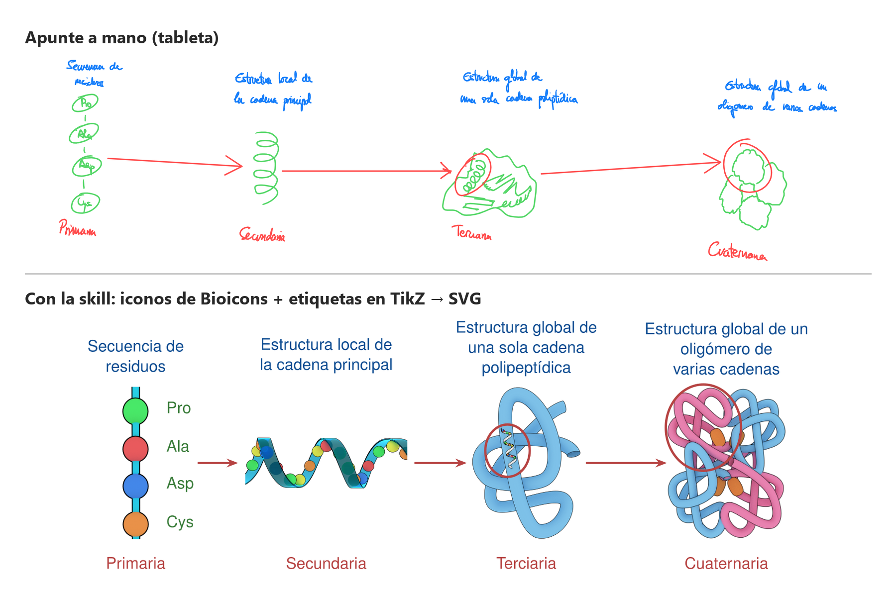

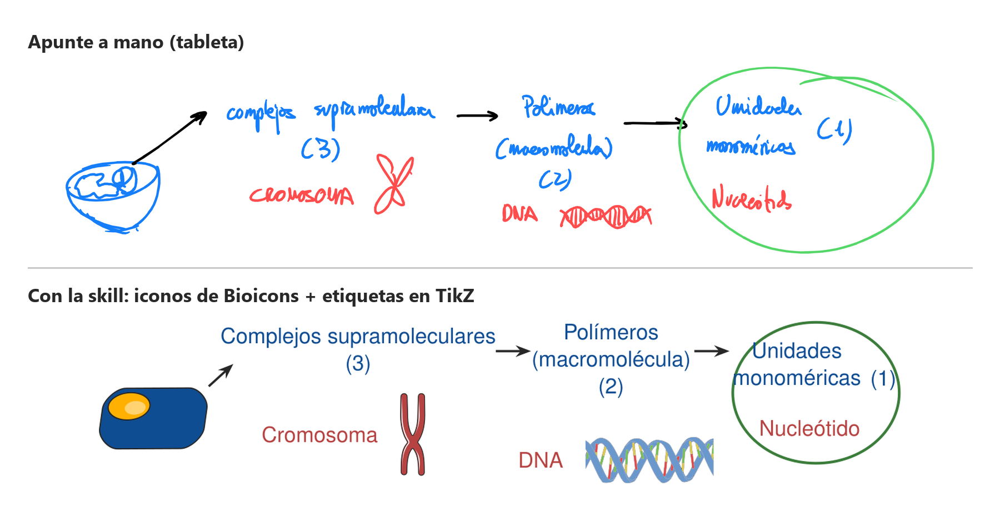

**El mismo icono, repetido.** El fosfolípido de Bioicons se coloca en la micela, la bicapa y la vesícula. La micela lleva **una cola**, como en la hoja; el icono trae dos, así que se ha derivado una versión de una cola:

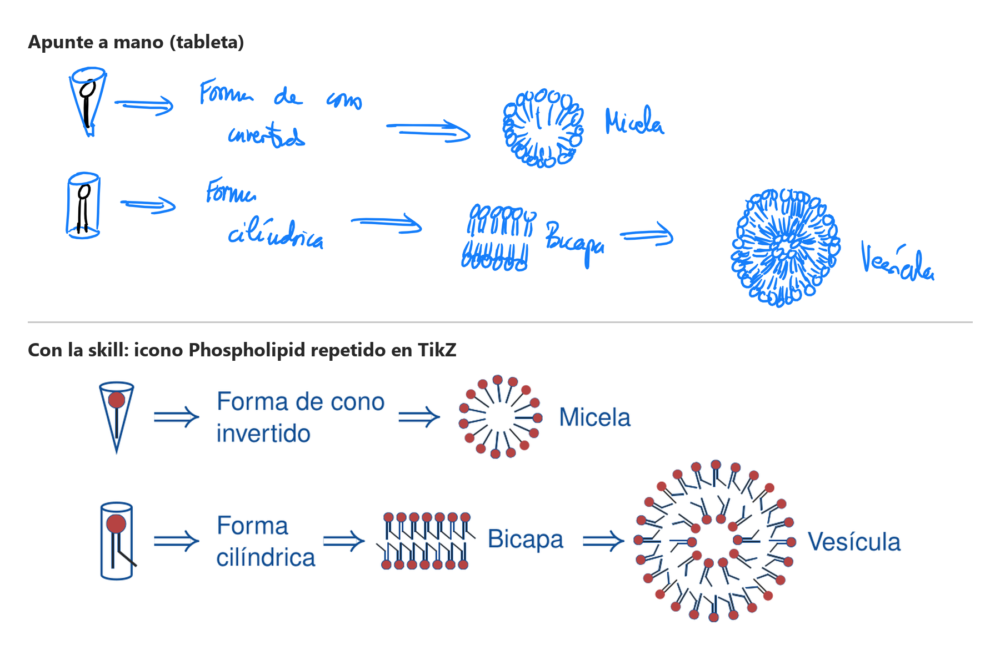

**Tu propio trazo.** Cuando un icono perdería algo del dibujo, se usa el trazo original de la tableta (recorte vectorial), con las etiquetas en tipografía:

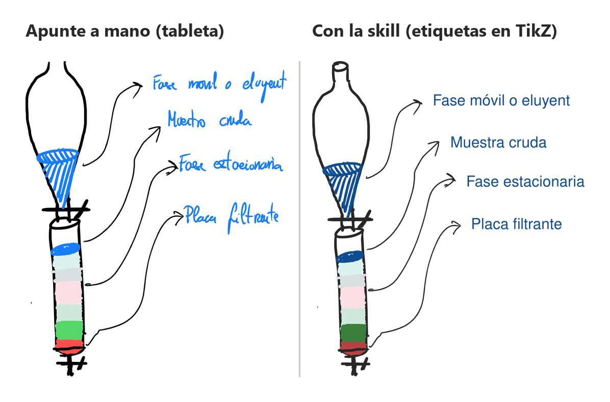

**Las 9 figuras figurativas de la v2.1**, 3 con iconos y 6 con recorte vectorial:

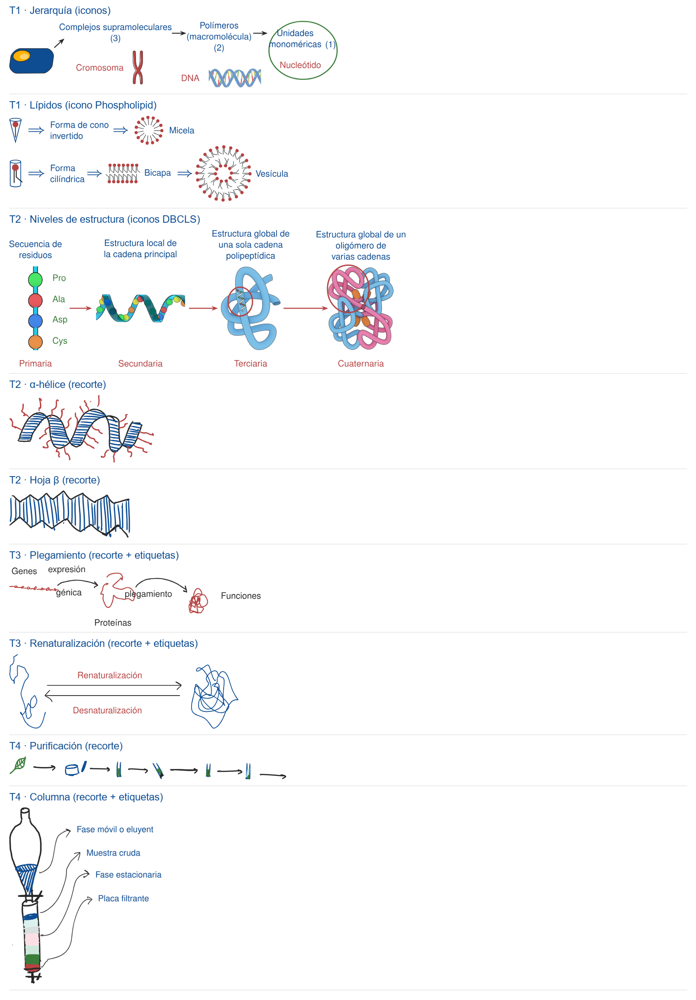

**Estilo v1 → v2.** El mismo dibujo, con la tipografía y la paleta de Apuntes.md:

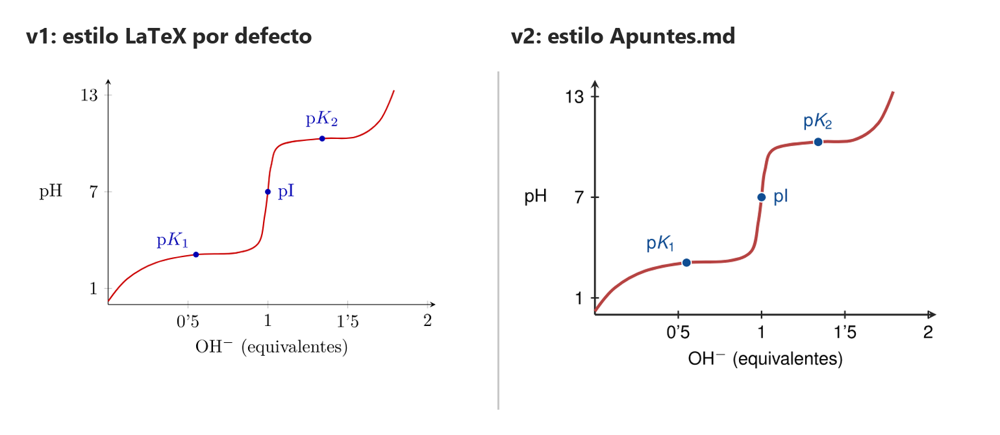

## Cómo trabaja

1. **Localiza** cada elemento sobre una cuadrícula de coordenadas:
   
2. **Lee** la letra por franjas ampliadas (los números y subíndices, a más resolución):
   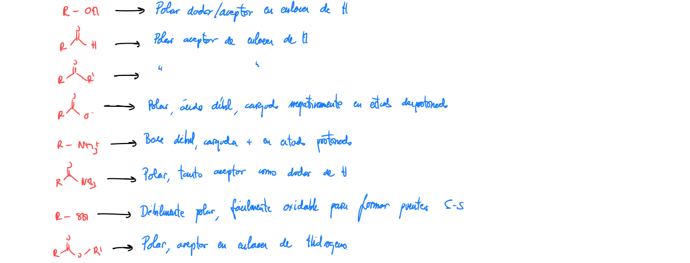
3. **Transcribe** con fidelidad, **aplica la estética** en una segunda pasada y **verifica** que el contenido no ha cambiado.

## Las notas

**Índice de la asignatura:** [Bioquímica](<bioquimica/Bioquímica.md>). Lo genera la skill `enlazar-apuntes` y tiene la tabla de temas y los **conceptos transversales**.

| Tema | Nota | Páginas originales |
|---|---|---|
| 1. Moléculas biológicas, el agua, interacciones débiles en medio acuoso | [Bioquímica - Tema 1](<bioquimica/Bioquímica - Tema 1.md>) | [2](hojas/pag-02.png) · [3](hojas/pag-03.png) · [4](hojas/pag-04.png) · [5](hojas/pag-05.png) |
| 2. Aminoácidos, enlace peptídico, estructuras primaria y secundaria | [Bioquímica - Tema 2](<bioquimica/Bioquímica - Tema 2.md>) | [6](hojas/pag-06.png) · [7](hojas/pag-07.png) · [8](hojas/pag-08.png) · [9](hojas/pag-09.png) |
| 3. Estructura terciaria i cuaternaria. Plegamiento y desnaturalización | [Bioquímica - Tema 3](<bioquimica/Bioquímica - Tema 3.md>) | [10](hojas/pag-10.png) |
| 4. Propiedades físico-químicas. Aislamiento, purificación y caracterización | [Bioquímica - Tema 4](<bioquimica/Bioquímica - Tema 4.md>) | [11](hojas/pag-11.png) |

> **Las notas están pensadas para Obsidian.** En GitHub se leen bien, pero hay tres cosas que solo se ven bien en Obsidian:
> - los callouts propios (definición, importante, fórmula, ficha) salen como citas simples;
> - los enlaces `[[Bioquímica - Tema 1#…|texto]]` se ven como texto entre corchetes;
> - las marcas de página `%% pág. N %%`, que en Obsidian son invisibles, se ven como texto.
>
> En tu vault, la skill las coloca en `Universidad/Química/2026-2027/Bioquímica/`; aquí están en `bioquimica/` para que la galería sea corta de navegar. Para verlas como son, copia `bioquimica/` a un vault y activa los fragmentos CSS de [`obsidian/`](../../skills/apuntes-a-md/obsidian/).

## Temas enlazados (v3)

**30 enlaces**, cada uno en la primera mención de un concepto por sección y apuntando a la sección donde se define. Por ejemplo, en el Tema 3:

```markdown
> Son combinaciones de unos pocos elementos de [[Bioquímica - Tema 2#Secundaria|estructura secundaria]] formando patrones…
```

- **Ni una palabra cambiada:** las 4 notas siguen verificando contra su transcripción (el Tema 4 solo marca 4 flechas que el autor quitó a mano).
- **Tags mínimos:** `apuntes`, `bioquimica` y `bioquimica/tema-N`.
- **Conceptos transversales del índice**, por ejemplo:

| Concepto | Se define en | Aparece en |
|---|---|---|
| efecto hidrofóbico | T1 | T2 · T3 |
| plegamiento | T3 | T1 · T2 · T4 |
| estructura secundaria | T2 | T3 · T4 |

## En Obsidian

**Índice plegable** con enlaces a cada sección del tema:

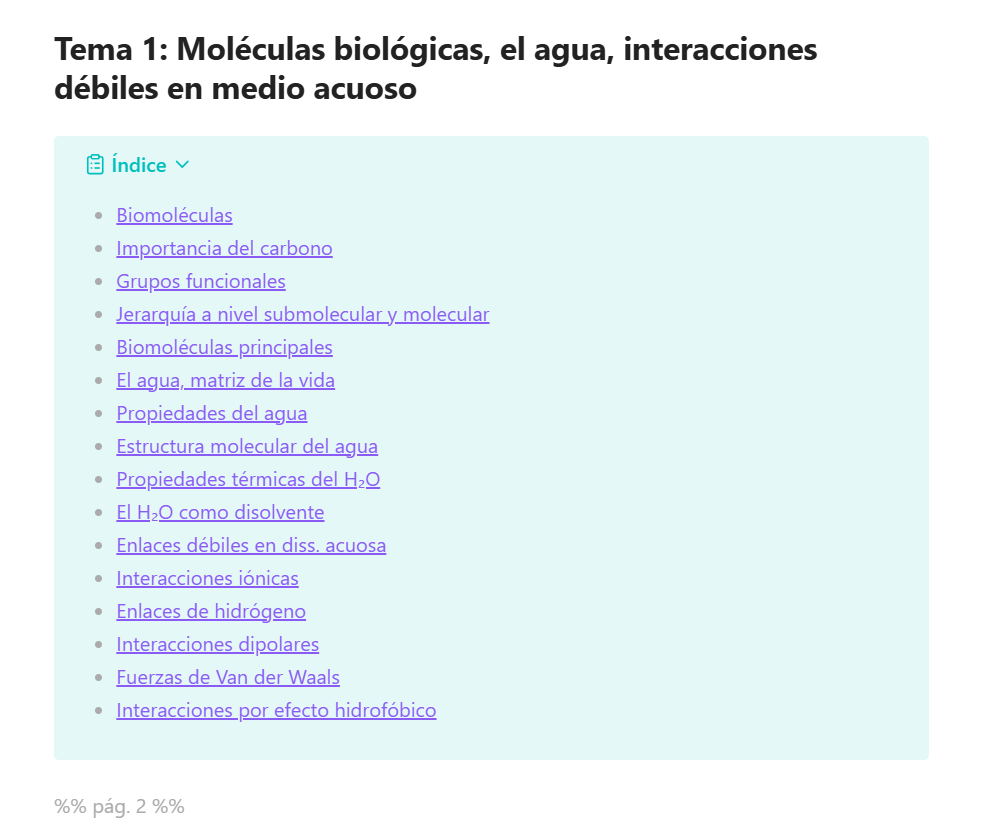

**Fórmula destacada y definición** (Tema 2):

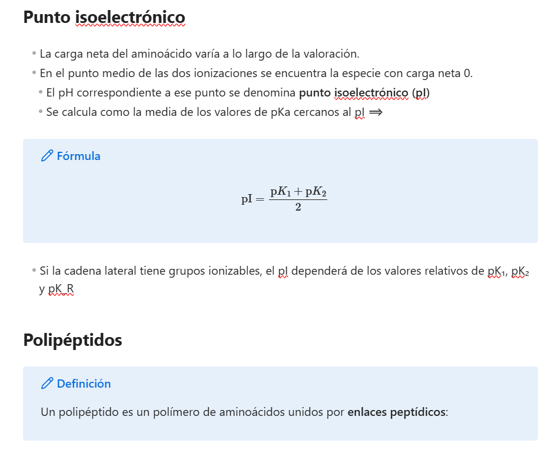

**Lo dudoso, marcado y no inventado**: los ángulos de la α-hélice van con `(?)` y el aviso lleva el recorte del original, para que el arreglo sea inmediato:

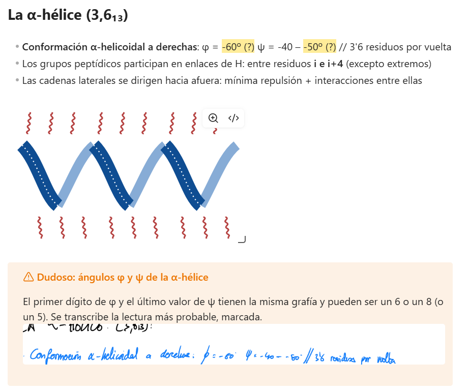

*Capturas hechas sin el fragmento `apuntes-estetica.css` activo, así que los callouts propios salen con el estilo por defecto de Obsidian. Con el fragmento activo, las definiciones van en verde y las fórmulas en azul.*

## Créditos de iconos

Las figuras de esta galería usan iconos de [Bioicons](https://bioicons.com/). Cada uno conserva su licencia, y solo se admiten CC0, CC-BY, MIT y BSD (nunca CC-BY-SA). El registro completo está en [`ICONOS.md`](../../skills/apuntes-a-md/iconos/ICONOS.md).

| Icono | Autor | Licencia | Origen | Usado en |
|---|---|---|---|---|
| simple_cell1 | Marnie-Maddock | CC0 | [bioicons](https://raw.githubusercontent.com/duerrsimon/bioicons/main/static/icons/cc-0/Cell_types/Marnie-Maddock/simple_cell1.svg) | Bioquímica T1 fig-02 |
| DNA_double_helix | James-Lloyd | CC0 | [bioicons](https://raw.githubusercontent.com/duerrsimon/bioicons/main/static/icons/cc-0/Nucleic_acids/James-Lloyd/DNA_double_helix.svg) | Bioquímica T1 fig-02 |
| Phospholipid | Cléber-Gomes | CC0 | [bioicons](https://raw.githubusercontent.com/duerrsimon/bioicons/main/static/icons/cc-0/Cell_membrane/Cl%C3%A9ber-Gomes/Phospholipid.svg) | Bioquímica T1 fig-11 |
| Phospholipid (derivado: una cola) | Cléber-Gomes | CC0 | [bioicons](https://raw.githubusercontent.com/duerrsimon/bioicons/main/static/icons/cc-0/Cell_membrane/Cl%C3%A9ber-Gomes/Phospholipid.svg) | Bioquímica T1 fig-11 |
| Protein_primary_structure | DBCLS | CC-BY 4.0 | [bioicons](https://raw.githubusercontent.com/duerrsimon/bioicons/main/static/icons/cc-by-4.0/Intracellular_components/DBCLS/Protein_primary_structure.svg) | Bioquímica T2 fig-03 |
| Protein_secondary_structure | DBCLS | CC-BY 4.0 | [bioicons](https://raw.githubusercontent.com/duerrsimon/bioicons/main/static/icons/cc-by-4.0/Intracellular_components/DBCLS/Protein_secondary_structure.svg) | Bioquímica T2 fig-03 |
| Protein_tertiary_structure | DBCLS | CC-BY 4.0 | [bioicons](https://raw.githubusercontent.com/duerrsimon/bioicons/main/static/icons/cc-by-4.0/Intracellular_components/DBCLS/Protein_tertiary_structure.svg) | Bioquímica T2 fig-03 |
| Protein_quaternary_structure | DBCLS | CC-BY 4.0 | [bioicons](https://raw.githubusercontent.com/duerrsimon/bioicons/main/static/icons/cc-by-4.0/Intracellular_components/DBCLS/Protein_quaternary_structure.svg) | Bioquímica T2 fig-03 |
| chromosome-red | Servier | CC-BY 3.0 | [bioicons](https://raw.githubusercontent.com/duerrsimon/bioicons/main/static/icons/cc-by-3.0/Genetics/Servier/chromosome-red.svg) | Bioquímica T1 fig-02 |

Licencias: [CC0 1.0](https://creativecommons.org/publicdomain/zero/1.0/) · [CC BY 3.0](https://creativecommons.org/licenses/by/3.0/) · [CC BY 4.0](https://creativecommons.org/licenses/by/4.0/). Los iconos se han convertido a PDF; algunos están recoloreados a la paleta o modificados, como indica `ICONOS.md`.
