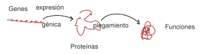
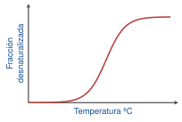
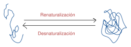

# Tema 3: Estructura terciaria i cuaternaria. Plegamiento y desnaturalización

> [!abstract]- Índice
> - [[#Motivos estructurales: estructuras supersecundarias]]
> - [[#Estructura terciaria]]
> - [[#Mantenimiento de la estructura terciaria]]
> - [[#Estructura cuaternaria]]
> - [[#Plegamiento (folding)]]

%% pág. 10 %%
## Motivos estructurales: estructuras supersecundarias

> [!definicion] Definición
> Son combinaciones de unos pocos elementos de [[Bioquímica - Tema 2#Secundaria|estructura secundaria]] formando patrones definidos: motivos sencillos se combinan para dar lugar a otros más complejos.

Se repiten en diversas proteínas sobretodo si tienen origen y/o funciones comunes.

## Estructura terciaria

> [!definicion] Definición
> Estructura tridimensional global que adopta una proteína al plegarse.

- Generalmente compacta, con gran cercanía entre los átomos situados en el interior de la estructura. (Fuerzas de [[Bioquímica - Tema 1#Fuerzas de Van der Waals|Van der Waals]])
- La aproximación espacial de los residuos **NO** implica cercanía de la secuencia.
- Las proteínas grandes suelen presentar **dominios estructurales**: zonas con estructura global casi autónoma, que mantienen si cortamos la cadena.

## Mantenimiento de la estructura terciaria

- Estabilizada por el gran número y diversidad de [[Bioquímica - Tema 1#Enlaces débiles en diss. acuosa|enlaces débiles]], sobre todo en las zonas internas (protegidas del H₂O):
  - [[Bioquímica - Tema 1#Interacciones por efecto hidrofóbico|Efecto hidrofóbico]]
  - Fuerzas de Vander Waals
  - Interacciones electrostáticas
  - Puentes disulfuro: si hay pares de [[Bioquímica - Tema 2#Aminoácidos neutros polares|Cys]] cercanos.

## Estructura cuaternaria

> [!definicion] Definición
> Asociación **NO** covalente de varias cadenas polipeptídicas

- **Subunidades**: monómeros y protómeros: organizados siguiendo las reglas de simetría
- **Ventajas de asociación**: mayor estabilidad y posibilidad de regulación alostérica.
- **Estabilidad del oligómero**: por interacción entre las superficies de las cadenas a través de [[Bioquímica - Tema 1#Enlaces débiles en diss. acuosa|enlaces débiles]].

## Plegamiento (folding)

> [!definicion] Definición
> Estructura funcional, proceso de adquisición de la estructura funcional (nativa)

- El plegamiento depende de las condiciones del medio
  - **Físicas**: T y P
  - **Químicas**: pH, disolventes orgánicos y agentes caotrópicos
  - Cooperativo ; reversible

### Experimento de Anfinsen

- El plegamiento y la desnaturalización son procesos en equilibrio

- Ovillo estadístico
- Irregular, variable, abierta
- Ausencia de [[Bioquímica - Tema 2#Secundaria|estructura secundaria]]
- Pocos enlaces intermoleculares
- Residuos hidrofóbicos expuestos

> [!importante] Importante
> Es un proceso favorable termodinámicamente debido al [[Bioquímica - Tema 1#Interacciones por efecto hidrofóbico|efecto hidrofóbico]].

- Regular, compacta
- Estructura secundaria
- Abundancia de enlaces intramoleculares
- Residuos hidrofóbicos no expuestos
