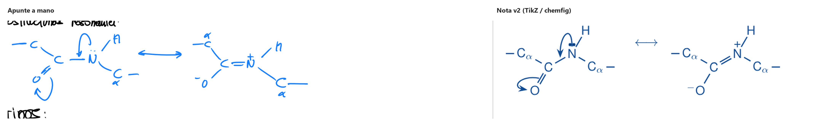
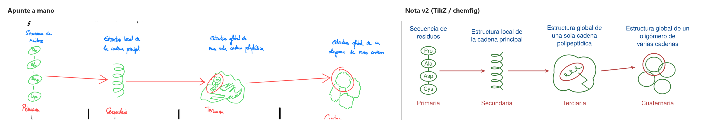
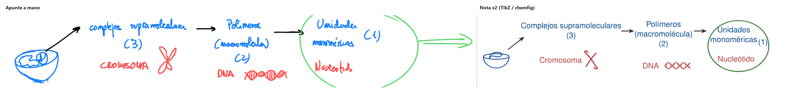
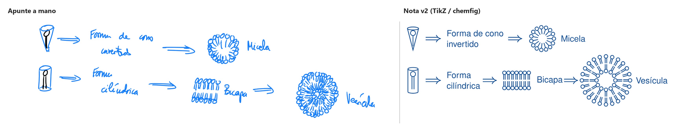

# Galería

Apuntes **reales** de Bioquímica (Temas 1–4, escritos a mano en tableta) convertidos con la skill [`apuntes-a-md`](../skills/apuntes-a-md/). Todo lo que hay aquí ha salido del flujo de la skill y ha pasado `verificar_contenido.py`: **ni una palabra cambiada** respecto a la transcripción.

## Antes y después

**Gráficas.** La forma de la curva y las marcas de la hoja, sin inventar valores:

**Química.** Estructuras resonantes del enlace peptídico en chemfig, con sus flechas curvas:

**Esquemas:**

**Estilo v1 → v2.** El mismo dibujo, con la tipografía y la paleta de Apuntes.md:

## Cómo trabaja

1. **Localiza** cada elemento sobre una cuadrícula de coordenadas:
   
2. **Lee** la letra por franjas ampliadas (los números y subíndices, a más resolución):
   
3. **Transcribe** con fidelidad, **aplica la estética** en una segunda pasada y **verifica** que el contenido no ha cambiado.

## Las notas

| Tema | Nota | Páginas originales |
|---|---|---|
| 1. Moléculas biológicas, el agua, interacciones débiles en medio acuoso | [Bioquímica - Tema 1](<bioquimica/Bioquímica - Tema 1.md>) | [2](hojas/pag-02.png) · [3](hojas/pag-03.png) · [4](hojas/pag-04.png) · [5](hojas/pag-05.png) |
| 2. Aminoácidos, enlace peptídico, estructuras primaria y secundaria | [Bioquímica - Tema 2](<bioquimica/Bioquímica - Tema 2.md>) | [6](hojas/pag-06.png) · [7](hojas/pag-07.png) · [8](hojas/pag-08.png) · [9](hojas/pag-09.png) |
| 3. Estructura terciaria i cuaternaria. Plegamiento y desnaturalización | [Bioquímica - Tema 3](<bioquimica/Bioquímica - Tema 3.md>) | [10](hojas/pag-10.png) |
| 4. Propiedades físico-químicas. Aislamiento, purificación y caracterización | [Bioquímica - Tema 4](<bioquimica/Bioquímica - Tema 4.md>) | [11](hojas/pag-11.png) |

> **Las notas están pensadas para Obsidian.** En GitHub se leen bien, pero los callouts propios (definición, importante, fórmula, ficha) salen como citas simples y las marcas de página `%% pág. N %%`, que en Obsidian son invisibles, se ven como texto. Para verlas como son, copia `bioquimica/` a un vault y activa los fragmentos CSS de [`obsidian/`](../skills/apuntes-a-md/obsidian/).

## En Obsidian

*(Capturas pendientes.)*

## Lo que viene (v2.1)

Los dibujos figurativos (material de laboratorio, hélices, plegamientos) todavía están en TikZ y son la parte más floja. La v2.1 los sustituye por iconos de [Bioicons](https://bioicons.com/) con licencia libre (CC0, MIT/BSD o CC-BY con atribución) o por **recortes vectoriales del propio dibujo de tableta**.
