> [!warning] Sin fecha en las págs. 2–3
> Las págs. 2–3 no llevan fecha escrita y no hay ninguna fecha en las páginas anteriores del cuaderno. La primera fecha aparece en la pág. 4.

# Tema 1: Moléculas biológicas, el agua, interacciones débiles en medio acuoso

> [!abstract]- Índice
> - [[#Biomoléculas]]
> - [[#Importancia del carbono]]
> - [[#Grupos funcionales]]
> - [[#Jerarquía a nivel submolecular y molecular]]
> - [[#Biomoléculas principales]]
> - [[#El agua, matriz de la vida]]
> - [[#Propiedades del agua]]
> - [[#Estructura molecular del agua]]
> - [[#Propiedades térmicas del H₂O]]
> - [[#El H₂O como disolvente]]
> - [[#Enlaces débiles en diss. acuosa]]
> - [[#Interacciones iónicas]]
> - [[#Enlaces de hidrógeno]]
> - [[#Interacciones dipolares]]
> - [[#Fuerzas de Van der Waals]]
> - [[#Interacciones por efecto hidrofóbico]]

%% pág. 2 %%
## Biomoléculas

Pueden ser inorgánicas (H₂O ~ 50%, 95%, e iones) o pueden ser orgánicas: derivados de hidrocarburos (combinaciones estables de carbono, (H, N, O, C ~ 99%)). Estructura determinadas por diferentes métodos de difracción. No se conocen biomoléculas fuera de estas características.

## Importancia del carbono

- Enlaces covalentes muy estables
- Tetravalencia (posibilidad de hasta 4 enlaces)
- Posibilidad de enlaces dobles tanto en cadenas como en anillos
- Cadenas complejas, largas, lineales o ramificadas
- Geometría tetraédrica → gran complejidad estructural.

## Grupos funcionales

Las biomoléculas pueden entenderse a través de las propiedades de sus **grupos funcionales** definiendo así las propiedades de la molécula. Existen las moléculas polifuncionales, cuyas propiedades mezclan las de todos los grupos funcionales presentes. Todo esto confiere a las biomoléculas de propiedades químicas como Ácido-Base, Red-Ox, fluorescencia...

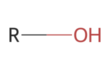
→ Polar dador/aceptor en enlaces de H

> [!ficha]- Ficha
> `smiles: *O`

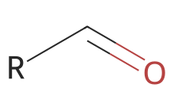
→ Polar aceptor de enlaces de H

> [!ficha]- Ficha
> `smiles: *C=O`

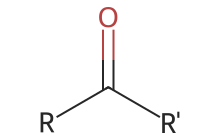
→ " "

> [!ficha]- Ficha
> `smiles: *C(*)=O`

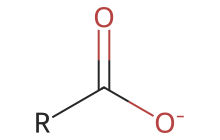
→ Polar, ácido débil, cargado negativamente en estado desprotonado

> [!ficha]- Ficha
> `smiles: *C(=O)[O-]`

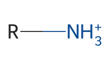
→ Base débil, cargada + en estado protonado

> [!ficha]- Ficha
> `smiles: *[NH3+]`

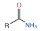
→ Polar, tanto aceptor como dador de H

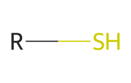
→ Débilmente polar, fácilmente oxidable para formar puentes S-S

> [!ficha]- Ficha
> `smiles: *S`

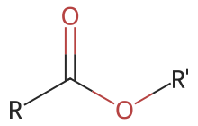
→ Polar, aceptor en enlaces de Hidrógeno.

> [!ficha]- Ficha
> `smiles: *OC(*)=O`

%% pág. 3 %%
## Jerarquía a nivel submolecular y molecular

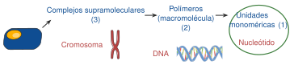

> [!importante] Importante
> ⟹ En BQ nos centramos en esta y quizás en polímeros.

## Biomoléculas principales

**Macromoléculas poliméricas**: formadas por asociación covalente de unidades monoméricas. La agrupación de monómeros crea las biomacromoléculas.

## El agua, matriz de la vida

- Fluido elemental de la materia viva
- medio solvente de las reacciones bioquímicas.
- Medio de difusión de sustancias (transporte de nutrientes y excreción)
- Regulador de condiciones físicas (p.e. temperatura)
- Sustrato de reacciones metabólicas.

## Propiedades del agua

### Propiedades químicas

- **Como medio solvente**: disuelve polares e iónicas y agrega hidrofóbicas
- Posibilita la ionización y la disolución de sales.
- Modula la formación de enlaces débiles
- Condiciona la estructura de membranas y macromoléculas

### Propiedades físicas

- Elevado calor específico ⟹ Mantener la temperatura estable
- Regulación de la presión osmótica.

> [!importante] Importante
> Todas las propiedades vienen de la estructura del agua.

## Estructura molecular del agua

- Hibridación sp³ del oxígeno. Estructura tetraédrica con geometría no lineal
- Diferencia de electronegatividad entre O y H
- Distribución asimétrica de e⁻
- Presencia de cargas parciales que provoca la posibilidad de formar puentes de H.
- Constante dieléctrica elevada (apantalla cargas)

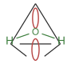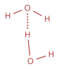

%% pág. 4 %%
> [!sesion] 16/IX/2026

## Propiedades térmicas del H₂O

- Líquida en un gran intervalo de temperaturas [1ºC - 99ºC]
- Forma una red extensa de P.H. en medio acuoso, que tiene como consecuencias:
  - Gran cohesión molecular
  - Alta tensión superficial
  - Elevada capacidad calorífica (amortigua cambios de T en el medio)
  - Elevado calor de vaporización (mecanismo de refrigeración)

En estado líquido la red de P.H. es **dinámica y desordenada** las moléculas ocupan **menor** volumen y por tanto su **densidad** es **mayor**

## El H₂O como disolvente

- **Moléculas hidrófilas**: iónicas se disuelven a través de esferas de solvatación, moléculas polares se disuelven por interacciones dipolo-dipolo y puentes de Hidrógeno
- **Moléculas hidrófobas**: no se disuelven, a su alrededor se organizan las moléculas de H₂O formando un **clatrato**. ⟹ **E. Hidrofóbico**: las moléculas apolares se agrupan disminuyendo su superficie aumentando la **entropía** (→ desorden!) del H₂O.

⟹ Proceso en 2 fases:

| | |
|---|---|
| [Solvatación] | 1. Al introducir el compuesto hidrofóbico las moléculas de H₂O se ordenan a su alrededor disminuyendo la entropía (generando orden) |
| [Agregación] | 2. Al buscar el mínimo contacto con las moléculas hidrofóbicas se liberan moléculas de H₂O aumentando el desorden y por tanto la entropía. |

> [!importante] Importante
> ⟹ El balance neto total es [$\Delta S > 0$]

## Enlaces débiles en diss. acuosa

- Pequeña E. de enlace pero son muchos en número
- Se forman y se rompen con facilidad: dinamismo y flexibilidad.
- Importantes para la estructura y función de las biomoléculas
- **Tipos**:
  1. Iónicos
  2. E. Hidrógeno
  3. Dipolares
  4. Van der Waals
  5. Efecto hidrofóbico

## Interacciones iónicas

- Entre átomos o grupos con carga neta: atracción para el signo opuesto, repulsión para el mismo signo. **Ley de Coulomb.**

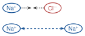

> [!formula] Fórmula
> $$F = K \frac{q_1 q_2}{\varepsilon r^2}$$

- $q_1 q_2$ → Directamente proporcional a la carga
- $\varepsilon r^2$ → Inversamente proporcional a distancia y polaridad de entorno
- No depende de la orientación !

- En macromoléculas dan lugar a **puentes salinos**: intervienen en interacciones inter e intra-moleculares estabilizando el plegamiento de las cadenas polipeptídicas ⟹

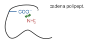

## Enlaces de hidrógeno

- Atracción débil entre un átomo de H en un grupo polar y un electronegativo de otro grupo polar.

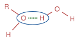

→ Dependen de **la distancia** y de **la orientación**.

%% pág. 5 %%
## Interacciones dipolares

- Entre dos dipolos permanentes: en grupos polares con distinta $\chi$ (−C=O, −N−H, −O−H, −S−H)
- Distancias menores que las iónicas
- Tienen que alinearse enfrentando sus polaridades opuestas (dependen de orientación y temperatura!)

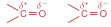

> [!formula] Fórmula
> $$F \propto \frac{1}{\varepsilon r^3}$$

## Fuerzas de Van der Waals

- Se deben a la interacción entre las nubes electrónicas de los átomos a distancias muy cortas. Al acercarse, las nubes se distorsionan dando lugar a dipolos inducidos (polarización). La máxima atracción se produce a una distancia igual a la suma de los radios de Van der Waals. A menor distancia aparecen interacciones fuertemente repulsivas.

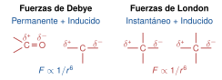

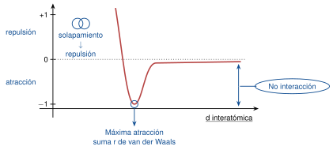

## Interacciones por efecto hidrofóbico

Por razones entrópicas el agua induce la agregación de grupos hidrofóbicos.

1. Cada lípido disperso rodea su parte **hidrofóbica** de moléculas de H₂O ordenadas: **clatratos**
2. Para aumentar la S del H₂O los lípidos se agregan exponiendo menor superficie hidrofóbica.
3. Dependiendo de la forma de los lípidos se forman bicapas o micelas

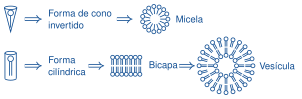
