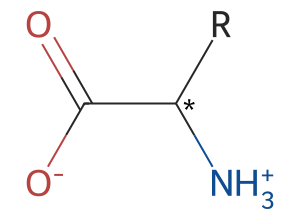
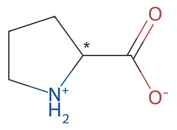
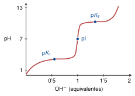
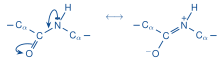
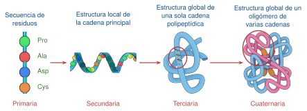
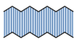

# Tema 2: Aminoácidos, enlace peptídico, estructuras primaria y secundaria de las proteínas

> [!abstract]- Índice
> - [[#α-Aminoácidos]]
> - [[#20 aminoácidos estándar]]
> - [[#Clasificación de los aminoácidos]]
> - [[#Aminoácidos aromáticos]]
> - [[#Aminoácidos neutros polares]]
> - [[#Aminoácidos básicos, carga positiva]]
> - [[#Aminoácidos ácidos, con carga negativa]]
> - [[#Aminoácidos NO estándar]]
> - [[#Aminoácidos proteicos modificados]]
> - [[#Propiedades A-B de los aminoácidos]]
> - [[#Punto isoelectrónico]]
> - [[#Polipéptidos]]
> - [[#Propiedades del enlace peptídico]]
> - [[#Péptidos]]
> - [[#Punto isoelectrónico de un péptido]]
> - [[#Proteínas]]
> - [[#Tipos de proteínas]]
> - [[#Mutaciones a nivel de proteínas]]
> - [[#Estructura tridimensional de las proteínas]]
> - [[#La α-hélice (3,6₁₃)]]
> - [[#La estabilidad de la α-hélice]]
> - [[#Cadenas y hojas β]]
> - [[#Giros β]]

%% pág. 6 %%
## α-Aminoácidos

> [!definicion] Definición
> Es un ácido carboxílico con un grupo amino sobre el carbono α

- Se diferencian en su cadena lateral ("R")
- Son quirales excepto la glicina (Gly)
- ==Sólo (?)== la forma L se encuentra en las protes naturales.

## 20 aminoácidos estándar

- Comparten características estructurales comunes
- Su parte variable se denomina cadena lateral

> [!importante] Importante
> Se representan a pH 7 ⟹ **Histidina !!**

*Amino (H₃N⁺) · carboxilo (COO⁻) · R → cambia para cada aminoácido*

> [!ficha]- Ficha
> `smiles: *C([NH3+])C(=O)[O-]`
> `estereo: sin indicar (C* quiral)`

## Clasificación de los aminoácidos

- Distintos criterios según las propiedades de la cadena lateral
- Dependiendo de sus características químicas:
  - Alifáticos apolares
  - Aromáticos
  - Neutros polares
  - Básicos // Ácidos

| Negativos | Positivos |
|:---:|:---:|
| Asp | His |
| Glu | Trp |
| | Tyr |
| | Phe |

> [!warning] Posible errata en el original
> En la columna "Positivos" aparecen Trp, Tyr y Phe, que en la propia hoja se clasifican como aromáticos. Se transcribe tal cual.

- La Prolina es un caso especial → Su cadena lateral ciclada implica **restricciones conformacionales**

> [!ficha]- Ficha
> `smiles: O=C([O-])C1CCC[NH2+]1`
> `estereo: sin indicar (C* quiral)`

## Aminoácidos aromáticos

- Cadenas laterales son hidrofóbicas, aunque Tyr y Trp presentan carácter parcialmente polar debido a sus grupos OH (de fenol) y NH (de indol)
- Absorben luz UV ($\lambda_{max} \sim 280$ nm). **Trp** es además fluorescente. Todo ello se utiliza para su análisis espectrofotométrico.

## Aminoácidos neutros polares

- **Cisteína**: puede encontrarse ionizada como tiolato (carga −) **a partir de pH ~ ==7'5 (?)==**. El grupo −SH es muy reactivo (carácter reductor). Dos moléculas de Cys se ==oxidan (?)== formando cistina mediante un puente disulfuro (−S−S−) **perdiendo su carácter polar**.
- **Tirosina**: puede encontrarse como tirosinato (carga −) **a partir de pH ~ 9**

## Aminoácidos básicos, carga positiva

- **Histidina**: se ioniza a **pH < 7** por lo que participa como catalizador A-B en centros activos de enzimas y en la regulación estructural con el pH de las proteínas en general.

%% pág. 7 %%
## Aminoácidos ácidos, con carga negativa

- Junto con los aminoácidos de carga positiva, participan en la formación de **enlaces iónicos** (puentes salinos) importantes para la estabilidad de la estructura proteica.

## Aminoácidos NO estándar

- **Selenocisteína** (Sec, U, Se-Cys): similar a la Cys pero con un grupo selenol en lugar de tiol. Se encuentra en enzimas oxidoreductoras.
- Otros aminoácidos derivados de los estándar con funciones biológicas importantes

| | | |
|---|---|---|
| **Neurotransmisores** | γ-aminobutírico (GABA) ⟹ derivado de **Glu** | **Serotonina** ⟹ derivado del Trp |
| **Hormonas** | tiroxina ⟹ derivado de la **tirosina** | Ácido indol acético ⟹ Derivado del triptófano |
| **Precursores e intermediarios metabólicos** | Citrulina y Ornitina. | |

## Aminoácidos proteicos modificados

- Las cadenas laterales correspondientes se modifican **después** de la síntesis proteica
- Proporcionan propiedades funcionales específicas que no se encuentran en aminoácidos estándar.

## Propiedades A-B de los aminoácidos

- Los aminoácidos son moléculas anfóteras: se comportan como un ácido y una base a la vez
- A pH=7 ⟹ **Zwitter ion** (iones híbridos) presentando simultáneamente carga + y −

### Curvas de valoración de los aminoácidos

- El estado de ionización de ==la (?)== varía con el pH y puede describirse con una curva de valoración.

- Cada escalón corresponde a un equilibrio de ionización
- El punto de inflexión en la escala del pH corresponde al **pKa** del grupo en cuestión
- Cada grupo ionizable actúa como tampón descrita cuya proporción por:

> [!formula] Fórmula
> $$\mathrm{pH} = \mathrm{p}K_a + \log \frac{[\mathrm{A}^-]}{[\mathrm{HA}]}$$

## Punto isoelectrónico

- La carga neta del aminoácido varía a lo largo de la valoración.
- En el punto medio de las dos ionizaciones se encuentra la especie con carga neta 0.
  - El pH correspondiente a ese punto se denomina **punto isoelectrónico (pI)**
  - Se calcula como la media de los valores de pKa cercanos al pI ⟹

> [!formula] Fórmula
> $$\mathrm{pI} = \frac{\mathrm{p}K_1 + \mathrm{p}K_2}{2}$$

- Si la cadena lateral tiene grupos ionizables, el pI dependerá de los valores relativos de p$K_1$, p$K_2$ y p$K_R$

## Polipéptidos

> [!definicion] Definición
> Un polipéptido es un polímero de aminoácidos unidos por **enlaces peptídicos**:

- Es un enlace **amida**
- Cada unidad de un polipéptido es un residuo de aminoácido
- Los residuos (menos el último) se nombran con la terminación "il", comenzando por el extremo N-terminal. **La cadena es DIRECCIONAL.**

%% pág. 8 %%
## Propiedades del enlace peptídico

- **Es rígido y planar**: carácter parcial de doble enlace (40%), confiriendo estructuras resonantes, sin libertad de giro, más corto que enlaces sencillos C-N
- Mayoritariamente en conformación trans **menos la Prolina por su estructura 3-D.**
- Los grupos **C=O** y **N-H** peptídicos **son polares pero no ionizables**, participan en la formación de enlaces de Hidrógeno

Estructuras resonantes:

## Péptidos

> [!definicion] Definición
> Son polímeros de unos pocos aminoácidos

- **Glutatión**: agente reductor. Protege las ==cels (?)== de prods oxidantes derivados del metabolismo del O₂
- **Vasopresina**: Hormona antidiurética. Regulación del equilibrio hídrico.
- **Oxitocina**: Hormona sexual. Secreción de leche + contracción muscular uterina durante el parto
- **Péptidos opiáceos**: Intervienen en el alivio del dolor.

## Punto isoelectrónico de un péptido

- La carga neta de un péptido varía con el pH en función de su secuencia de aminoácidos
- Por su corta secuencia se puede calcular como el promedio de p$K_R$ **(de forma APROXIMADA)**

## Proteínas

> [!definicion] Definición
> Son cadenas largas polipeptídicas que adquieren estructuras bien definidas

- Responsables de la mayoría de las funciones biológicas: catálisis, transporte, estructura, almacenamiento, movimiento, detoxificación, defensa, regulación.

## Tipos de proteínas

- **Según su forma**: Fibrilares o globulares
- **Según su composición**: simples, conjugadas ⟹ prote + grupo prostético
- **Según su grupo prostético**: glucoproteínas, lipoproteínas, metaloproteínas, hemoproteínas, fosfoproteínas
- Hay 4 niveles de estudio de la estructura de las proteínas:

### Primaria

**Secuencia de aminoácidos**:

- Su número y orden en una dirección determinada
- Específica de cada proteína
- Codificada en el genoma
- Poco variable en una especie
- Semejantes ⟹ **homólogos**
- Pertenecer a la misma familia ⟹ origen evolutivo común

### Secundaria

- Patrones repetitivos de conformación local.
- Depende de la combinación de rotámeros φ y ψ. limitados por el choque estérico
- La conformación más favorable depende de la secuencia de aminoácidos

%% pág. 9 %%
## Mutaciones a nivel de proteínas

- Cambios en la secuencia de aminoácidos respecto a la secuencia natural
- Se originan a nivel de genoma.
- Los residuos importantes suelen ser poco variables o presentan **mutaciones conservadoras**
- Los cambios pueden dar lugar a enfermedades o evolución.
- En virus y bacterias la tasa de mutación es muy alta.

## Estructura tridimensional de las proteínas

- La mayoría de las protes presentan una estructura 3D bien definida
- **Depende de**: secuencia de aminoácidos y de las características del medio
- Posibilita la función de la proteína
- 3 niveles ⟹ Secundaria (cadena plegada), Terciaria (plegamiento global), Cuaternaria (Organización espacial de varias cadenas)

## La α-hélice (3,6₁₃)

- **Conformación α-helicoidal a derechas**: φ = ==-60º (?)== ψ = -40 – ==-50º (?)== // 3'6 residuos por vuelta
- Los grupos peptídicos participan en enlaces de H: entre residuos **i e i+4** (excepto extremos)
- Las cadenas laterales se dirigen hacia afuera: mínima repulsión + interacciones entre ellas

> [!warning] Dudoso: ángulos φ y ψ de la α-hélice
> El primer dígito de φ y el último valor de ψ tienen la misma grafía y pueden ser un 6 o un 8 (o un 5). Se transcribe la lectura más probable, marcada.
> 

## La estabilidad de la α-hélice

- **Contribución principal**: enlaces de H entre grupos CO y -NH peptídicos (i con i+4)
- **Interacciones por cadenas laterales**: residuo i con i+3 e i+4, y con i-3 e i-4 son de carácter electrostático y/o por efecto hidrofóbico.
- Residuos que **desestabilizan** la hélice α:

| | |
|---|---|
| **Glicina (Gly)** | no tiene R ⟶ demasiada flexibilidad |
| **Prolina** | restringe el giro de φ; no tiene -NH para formar enlaces de H |
| **R. voluminosos** | Trp y ramificados en el carbono β (Val, Thr) |

- La alineación de grupos C=O y NH genera un macrodipolo que estabiliza la hélice.

## Cadenas y hojas β

- **Cadenas β**: segmentos en conformaciones extendidas
- Apariencia de lámina plegada.
- Cadenas paralelas o antiparalelas
- La **prolina** no es compatible con cadenas β.
- Son frecuentes los residuos voluminosos
- Puede haber interacciones entre las cadenas laterales

## Giros β

- Cambian la dirección de la cadena 180º: conectan entre sí cadenas β antiparalelas en **hojas y horquillas β**
- Son giros cortos y cerrados: implican 4 residuos: poco voluminosos (Gly y Pro) enlaces de H entre i e i+3
- Hasta 9 tipos distintos
