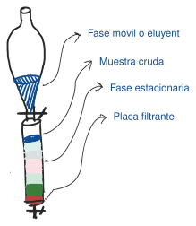

# Tema 4: Propiedades físico-químicas. Aislamiento, purificación y caracterización

> [!abstract]- Índice
> - [[#Propiedades de las proteínas]]
> - [[#Espectros UV-Vis de proteínas]]
> - [[#Espectros de dicroísmo circular]]
> - [[#Métodos de separación de proteínas]]
> - [[#Cromatografía en columna]]

%% pág. 11 %%
## Propiedades de las proteínas

| | |
|---|---|
| **Tamaño** | escala nanométrica |
| **Polaridad** | depende de la secuencia y la distribución de aminoácidos, en general son anfipáticas: entorno acuoso y lipídico |
| **Ácido-Base** | depende de secuencia: residuos ácidos y básicos. **Punto Isoelectrónico**. Se determina experimentalmente, influye en la solubilidad. |
| **Solubilidad en medio acuoso** | depende de la proporción y distribución de residuos polares/hidrofóbicos. Menos soluble a pH = pI **[Salting out / Salting in]** |
| **Hidratación** | las moléculas atraen moléculas de agua sobre su superficie. Si son fibras insolubles se hinchan al hidratarse. |
| **Gelificación** | tienden a formar geles, dependiendo del pH, de la fuerza iónica y de la temperatura. |
| **Suspensiones coloidales.** | |

## Espectros UV-Vis de proteínas

- **Cromóforos de proteínas**:

| | |
|---|---|
| C=O peptídicos | (~200 nm) |
| Aromáticos | Trp (~280 nm), Tyr (274 nm), Phe (257 nm) |
| Cationes metálicos | (en Vis) |
| NAD⁺/NADH | (en UV) |

## Espectros de dicroísmo circular

- Los enlaces peptídicos son quirales: interaccionan de manera diferenciada con la luz polarizada. Dependen de la estructura secundaria
- **Aplicaciones**: determinar estructuras secundarias y estudios de estabilidad y plegamiento.

## Métodos de separación de proteínas

- Se utilizan en estrategias de purificación y en métodos de análisis
- **Tipos**: sedimentación, precipitación selectiva, diálisis, ultrafiltración, electroforesis.

- **Purificación**: separaciones cromatográficas ⟶ diálisis/ultrafiltración
- **Análisis**: electroforesis, espectroscopia, determinación estructural.

## Cromatografía en columna

### Tipos de cromatografía

- Dependiendo del tipo de fase estacionaria:

|                         |                                                                                      |
| ----------------------- | ------------------------------------------------------------------------------------ |
| **Intercambio iónico**  | La fase estacionaria carga + o - e interacciona con la muestra                       |
| **fase reversa**        | La fase estacionaria es hidrofóbica y separa componentes en función de la polaridad. |
| **afinidad**            | Las moléculas se separan dependiendo de su unión específica a grupos de la F.E       |
| **exclusión molecular** | Separa las moléculas se separan en función de su tamaño                              |
